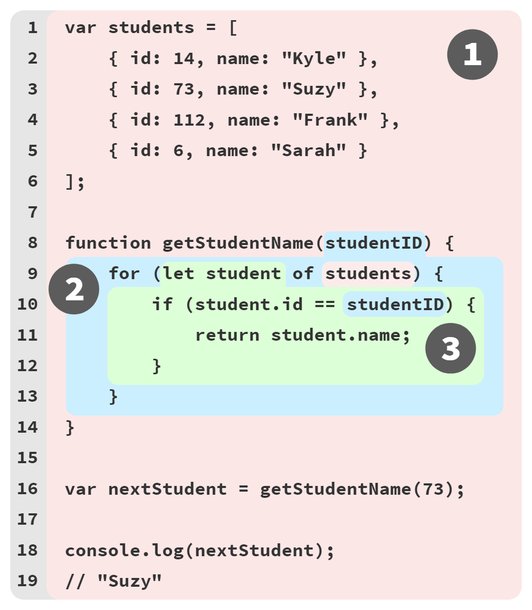
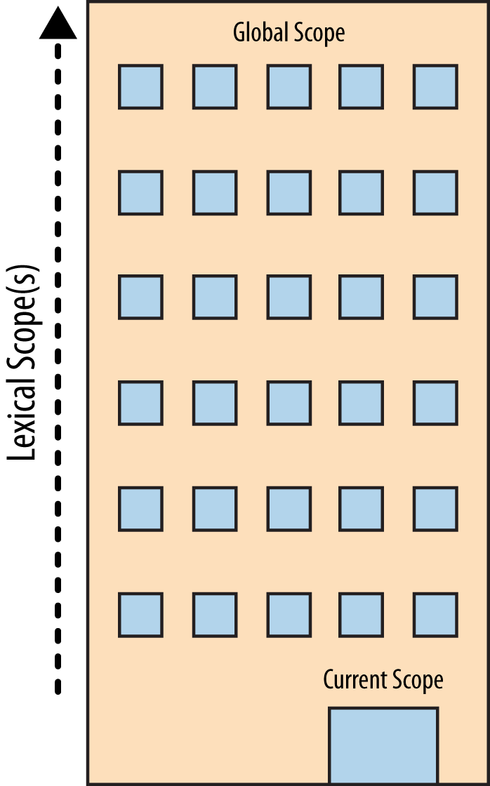

# Aún no sabes JS: Alcance & Closures - 2da Edición
# Capítulo 2: Entendiendo el Alcance Léxico

En el Capítulo 1, exploramos cómo se determina el alcance en la compilación del código, un modelo llamado "alcance léxico".

Antes de llegar a los detalles de cómo usar el alcance léxico en nuestros programas, debemos asegurarnos de tener una buena base conceptual sobre cómo funciona el alcance. Este capítulo ilustrará el *alcance* con varias metáforas. El objetivo aquí es *pensar* sobre cómo el motor JS maneja su programa de manera que coincida más estrechamente con el funcionamiento real del motor JS.

## Cubos, burbujas y canicas ... ¡Oh Dios mío!

Una metáfora que he encontrado efectiva para comprender el alcance es clasificar las canicas de colores en cubos de su color correspondiente.

Imagine que se encuentra con una pila de canicas y nota que todas las canicas son de color rojo, azul o verde. Para clasificar todas las canicas, dejemos las rojas en una cubeta roja, las verdes en una cubeta verde y las azules en una cubeta azul. Después de la clasificación, cuando más tarde necesite una canica verde, ya sabe que el cubo verde es a dónde debe ir para obtenerlo.

En esta metáfora, las canicas son las variables en nuestro programa. Los cubos son ámbitos (funciones y bloques), a los que simplemente asignamos conceptualmente colores individuales para nuestros propósitos de discusión. El color de cada canica queda así determinado por el alcance *color* en el que encontramos la canica originalmente creada.

Anotemos el ejemplo del programa del Capítulo 1 con etiquetas de color de alcance:

```js
// outer/global scope: RED

var students = [
    { id: 14, name: "Kyle" },
    { id: 73, name: "Suzy" },
    { id: 112, name: "Frank" },
    { id: 6, name: "Sarah" }
];

function getStudentName(studentID) {
    // function scope: BLUE

    for (let student of students) {
        // loop scope: GREEN

        if (student.id == studentID) {
            return student.name;
        }
    }
}

var nextStudent = getStudentName(73);
console.log(nextStudent);
// Suzy
```

Hemos designado 3 colores de alcance con comentarios de código: ROJO (alcance global más externo), AZUL (alcance de la función `getStudentName(..)`) y VERDE (alcance del/dentro-del bucle `for`). Pero aún puede ser difícil reconocer los límites de estos segmentos de alcance cuando se mira una lista de códigos.

La Figura 2 intenta hacer que los límites del alcance sean más fáciles de visualizar dibujando burbujas de colores alrededor de cada alcance:

<figure>
    
    <figcaption><em>Fig. 2: Burbujas de alcance anidadas</em></figcaption>
</figure>

1. **Burbuja 1** (ROJO) abarca el alcance global, que tiene tres identificadores/variables: `students` (línea 1), `getStudentName` (línea 8) y `nextStudent` (línea 16).

2. **Burbuja 2** (AZUL) abarca el alcance de la función `getStudentName(..)` (línea 8), que tiene un solo identificador/variable: el parámetro `studentID` (línea 8).

3. **Burbuja 3** (VERDE) abarca el alcance del bucle `for` (línea 9), que tiene un solo identificador/variable: `student` (línea 9).

Las burbujas de alcance se determinan durante la compilación en función de dónde se escriben las funciones/bloques de alcance, el anidamiento entre sí, etc. Cada burbuja de alcance está completamente contenida dentro de su burbuja de alcance principal: un alcance nunca está parcialmente en dos ámbitos externos diferentes.

Cada canica (variable/identificador) se colorea en función de la burbuja (cubo) en la que se declara, no del color del alcance desde el que se puede acceder (por ejemplo, `students` en la línea 9 y `studentID` en la línea 10).

| NOTA: |
| :--- |
| Recuerde que afirmamos en el Capítulo 1 que `id`,`name`, y `log` son todas propiedades, no variables; en otras palabras, no son canicas en cubos, por lo que no se colorean según las reglas que discutimos en este libro. Para comprender cómo se manejan dichos accesos de propiedad, consulte el Libro 3 *Objetos y clases*. |

A medida que el motor JS procesa un programa (durante la compilación) y encuentra una declaración para una variable, esencialmente pregunta: "¿en qué *color* alcance (burbuja, cubo) estoy actualmente?" La variable se designa como el mismo *color*, lo que significa que pertenece a ese cubo/burbuja.

El cubo VERDE está completamente anidado dentro del cubo AZUL, y de manera similar el cubo AZUL está completamente anidado dentro del cubo ROJO. Los ámbitos pueden anidarse uno dentro del otro como se muestra, hasta cualquier profundidad de anidamiento que necesite su programa.

Las referencias (no declaraciones) a variables/identificadores se pueden hacer desde el alcance actual o desde cualquier alcance por encima/fuera del alcance actual, pero nunca a los ámbitos inferiores/anidados. Entonces, una expresión en el cubo ROJO solo tiene acceso a canicas ROJAS, no AZUL o VERDE. Una expresión en el cubo AZUL puede hacer referencia a canicas AZULES o ROJAS, no VERDES. Y una expresión en el cubo VERDE tiene acceso a las canicas ROJA, AZUL y VERDE.

Podemos conceptualizar el proceso de determinación de estos no-declarados colores de canicas durante el tiempo de ejecución como una búsqueda. Dado que la referencia variable `students` en la declaración de bucle `for` en la línea 9 no es una declaración, no tiene color. Por lo tanto, le preguntamos al segmento de alcance actual (AZUL) si tiene una canica que coincida con ese nombre. Como no lo hace, la búsqueda continúa con el siguiente ámbito externo / de contención (RED). El cubo ROJO tiene una canica con el nombre `students`, por lo que la variable `students` de la declaración de bucle se determina que es una canica ROJA.

El `if(student.id == studentID)` en la línea 10 se determina de manera similar para hacer referencia a una canica VERDE llamada `student` y a una canica AZUL` studentID`.

| NOTA: |
| :--- |
| El motor JS generalmente no determina estos colores de canicas durante el tiempo de ejecución; La "idea" aquí es encontrar una manera retórica para ayudarte a comprender los conceptos. Durante la compilación, la mayoría o todas las referencias a variables serán de segmentos de alcance ya conocidos, por lo que su color se determina así y se almacena con cada referencia de color para evitar búsquedas innecesarias a medida que se ejecuta el programa. Más sobre esto en el próximo capítulo. |

Los puntos clave de las canicas y los cubos (¡y las burbujas!):

* Las variables se declaran en ciertos ámbitos, que se pueden considerar como canicas de colores en cubos de colores coincidentes.

* Cualquier referencia a una variable del mismo nombre en ese alcance, o cualquier alcance anidado más profundo, será una canica del mismo color, a menos que un alcance intermedio "sombree" la declaración de la variable; ver el Capítulo 3 "Sombreado".

* La determinación de los cubos de colores, y las canicas que contienen, ocurre durante la compilación. Esta información se utiliza para "búsquedas" de variables (canicas de color) durante la ejecución del código.

## Una conversación entre amigos

Otra metáfora útil para el proceso de análisis de variables y los ámbitos de los que provienen es imaginar varias conversaciones que se llevan a cabo dentro del motor a medida que se procesa el código y luego se ejecuta. Podemos "escuchar" estas conversaciones para obtener una mejor base conceptual sobre cómo funcionan los ámbitos.

Ahora conozcamos a los miembros del motor JS que tendrán conversaciones mientras procesan ese programa:

1. *Motor*: responsable de la compilación y ejecución de principio a fin de nuestro programa JavaScript.

2. *Compilador*: uno de los amigos del *Motor*; maneja todo el trabajo sucio de análisis y generación de código (ver sección anterior).

3. *Scope Manager* (Manejador de alcance): otro amigo del *Motor*; recopila y mantiene una lista de búsqueda de todas las variables / identificadores declarados, y aplica un conjunto de reglas sobre cómo son accesibles para el código que se está ejecutando actualmente.

Para que usted *entienda completamente* cómo funciona JavaScript, debe comenzar a *pensar* como *Motor* (y como sus amigos) piensan, hacen las preguntas que hacen y responden sus preguntas de la misma manera.

Para explorar estas conversaciones, recuerde nuevamente nuestro ejemplo de programa en ejecución:

```js
var students = [
    { id: 14, name: "Kyle" },
    { id: 73, name: "Suzy" },
    { id: 112, name: "Frank" },
    { id: 6, name: "Sarah" }
];

function getStudentName(studentID) {
    for (let student of students) {
        if (student.id == studentID) {
            return student.name;
        }
    }
}

var nextStudent = getStudentName(73);

console.log(nextStudent);
// Suzy
```

Examinemos cómo JS va a procesar ese programa, comenzando específicamente con la primera declaración. El arreglo y su contenido son solo literales de valores JS básicos (y, por lo tanto, no se ven afectados por ninguna inquietud de alcance), por lo que nuestro enfoque aquí estará en la declaración `var students = [..]` y las partes de inicialización-asignación.

Normalmente pensamos en eso como una declaración única, pero no es así como lo ve nuestro amigo *Motor*. De hecho, *Motor* ve dos operaciones distintas, una que *Compilador* manejará durante la compilación y la otra que *Motor* manejará durante la ejecución.

Lo primero que *Compilador* hará con este programa es realizar lexing para dividirlo en tokens, que luego se analizará en un árbol (AST).

Una vez que *Compilador* llega a la generación de código, hay más detalles a considerar de lo que puede parecer obvio. Una suposición razonable sería que *Compilador* producirá código para la primera instrucción, como por ejemplo: "Asignar memoria para una variable, etiquetarla como `students`, luego pegar una referencia al arreglo en esa variable". Pero hay más que eso.

Así es como *Compilador* manejará esa declaración:

1. Al encontrar `var students`, *Compilador* le preguntará a *Scope Manager* para ver si ya existe una variable llamada `students` para ese segmento de alcance en particular. Si es así, *Compilador* ignoraría esta declaración y seguiría adelante. De lo contrario, *Compilador* producirá un código que (en el momento de la ejecución) le pide a *Scope Manager* que cree una nueva variable llamada `students` en ese segmento de alcance.

2. *Compilador* luego produce código para *Motor*, para luego ejecutarlo y manejar la asignación `students = []`. El código que ejecuta *Motor* primero preguntará a *Scope Manager* si hay una variable llamada `students` accesible en el segmento de alcance actual. Si no, *Motor* sigue buscando en otra parte (ver "Ámbito anidado" a continuación). Una vez que *Motor* encuentra una variable, le asigna la referencia del arreglo `[..]`.

En forma conversacional, la primera fase de compilación del programa podría desarrollarse entre *Compilador* y *Scope Manager* de esta manera:

> ***Compilador***: Hola *Scope Manager* (del alcance global), encontré una declaración formal para un identificador llamado `students`, ¿alguna vez oyeron hablar de él?

> ***(Global) Scope Manager***: No, no he oído hablar de él, así que ahora lo he creado para ti.

> ***Compilador***: Hola *Scope Manager*, encontré una declaración formal para un identificador llamado `getStudentName`, ¿alguna vez escuchaste de él?

> ***(Global) Scope Manager***: No, pero acabo de crearlo para ti.

> ***Compilador***: Hola *Scope Manager*, `getStudentName` apunta a una función, por lo que necesitamos un nuevo segmento de alcance.

> ***(Function) Scope Manager***: Lo tengo, aquí está.

> ***Compilador***: Hola *Scope Manager* (de la función), encontré una declaración de parámetro formal para `studentID`, ¿alguna vez has oído hablar de ella?

> ***(Function) Scope Manager***: No, pero ahora está registrado en este ámbito.

> ***Compilador***: Hola *Scope Manager* (de la función), encontré un bucle `for` que necesitará su propio segmento de alcance.

> ...

La conversación es un intercambio de preguntas y respuestas, donde **Compilador** pregunta al actual *Scope Manager* si ya se ha encontrado una declaración de un identificador. Si "no", *Scope Manager* crea esa variable en ese ámbito. Si la respuesta fuera "sí", entonces se omitiría de manera efectiva ya que no hay nada más que ese *Scope Manager* pueda hacer.

*Compilador* también señala cuando se ejecuta a través de funciones o ámbitos de bloque, de modo que se puede crear una instancia de un nuevo segmento de alcance y *Scope Manager*.

Más tarde, cuando se trata de la ejecución del programa, la conversación continuará entre *Motor* y *Scope Manager*, y podría desarrollarse así:

> ***Motor***: Hola *Scope Manager* (del alcance global), antes de comenzar, ¿puedes buscar el identificador `getStudentName` para que pueda asignarle esta función?

> ***(Global) Scope Manager***: Sí, aquí tienes.

> ***Motor***: Hola *Scope Manager*, encontré una referencia *Objetivo* para `students`, ¿alguna vez escuchaste de ella?

> ***(Global) Scope Manager***: Sí, se declaró formalmente para este alcance, y ya se ha inicializado como `undefined`, por lo que está listo para asignarlo. Aqui tienes.

> ***Motor***: Hola *Scope Manager* (del alcance global), encontré una referencia *objetivo* para `nextStudent`, ¿alguna vez escuchaste de ella?

> ***(Global) Scope Manager***: Sí, se declaró formalmente para este alcance, y ya se ha inicializado como `undefined`, por lo que está listo para asignarlo. Aqui tienes.

> ***Motor***: Hola *Scope Manager* (del alcance global), encontré una referencia *fuente* para `getStudentName`, ¿alguna vez escuchaste de ella?

> ***(Global) Scope Manager***: Sí, se declaró formalmente para este alcance. Aqui tienes.

> ***Motor***: Genial, el valor en `getStudentName` es una función, así que lo voy a ejecutar.

> ***Motor***: Hola *Scope Manager*, ahora necesitamos instanciar el alcance de la función.

> ...

Esta conversación es otro intercambio de preguntas y respuestas, donde *Motor* primero le pide al *Scope Manager* actual que busque el identificador `getStudentName` izado para asociar la función con él. *Motor* luego procede a preguntar a *Scope Manager* sobre la referencia *objetivo* para `students`, y así sucesivamente.

Para revisar y resumir cómo se procesa una declaración como `var students = [..]`, en dos pasos distintos:

1. *Compilador* configura la declaración de la variable de alcance (ya que no se declaró previamente en el alcance actual).

2. Mientras *Motor* está ejecutando, dado que la declaración tiene una asignación de inicialización, *Motor* le pide a *Scope Manager* que busque la variable y la asigna una vez que se encuentra.

## Alcance anidado

Cuando llega el momento de ejecutar la función `getStudentName()`, *Motor* solicita una instancia de *Scope Manager* para el alcance de esa función, y luego procederá a buscar el parámetro (`studentID`) para asignar el `73` valor de argumento para, y así sucesivamente.

El alcance de la función para `getStudentName(..)` está anidado dentro del alcance global. El alcance del bloque del bucle `for` está anidado de manera similar dentro del alcance de esa función. Los ámbitos se pueden anidar léxicamente a cualquier profundidad arbitraria según lo defina el programa.

Cada ámbito obtiene su propia instancia de *Scope Manager* cada vez que se ejecuta ese ámbito (una o más veces). Cada ámbito tiene automáticamente todos sus identificadores registrados (esto se denomina "elevación (hoisting) de variables"; consulte el Capítulo 5).

Al comienzo de un ámbito, si algún identificador proviene de una declaración de `function`, esa variable se inicializa automáticamente a su referencia de función asociada. Y si algún identificador proviene de una declaración `var` (en oposición a `let` / `const`), esa variable se inicializa automáticamente a `undefined` para que pueda usarse; de lo contrario, la variable permanece sin inicializar (es decir, en su "TDZ", consulte el Capítulo 3) y no puede utilizarse hasta que se ejecute su declaración e inicialización.

En la declaración `for (let student of students) {` la declaración `students` es una referencia *fuente* que debe buscarse. Pero, ¿cómo se manejará esa búsqueda, ya que el alcance de la función no encontrará dicho identificador?

Para entender eso, imaginemos que esa conversación se desarrolla así:

> ***Motor***: Hola *Scope Manager* (para la función), tengo una referencia *fuente* para `students`, ¿alguna vez has oído hablar de ella?

> ***(Función) Scope Manager***: No, nunca he oído hablar de él. Prueba el siguiente alcance externo.

> ***Motor***: Hola *Scope Manager* (para el alcance global), tengo una referencia *fuente* para `students`, ¿alguna vez has oído hablar de él?

> ***(Global) Scope Manager***: Sí, se declaró formalmente, aquí tienes.

> ...

Uno de los aspectos más importantes del alcance léxico es que cada vez que no se puede encontrar una referencia de identificador en el alcance actual, se consulta el siguiente alcance externo en el anidamiento; ese proceso se repite hasta que se encuentra una respuesta o no hay más ámbitos para consultar.

### Fallos de Búsqueda

Cuando *Motor* agota todos los ámbitos *disponibles léxicamente* y aún no puede resolver la búsqueda de un identificador, entonces existe una condición de error. Sin embargo, dependiendo del modo del programa (modo estricto o no) y el rol de la variable (es decir, *objetivo* vs. *alcance*; ver Capítulo 1), esta condición de error se manejará de manera diferente.

Si la variable es una *fuente*, una búsqueda de identificador no resuelta se considera una variable no declarada (desconocida, faltante), lo que resulta en un `ReferenceError`. Además, si la variable es un *objetivo*, y el código en ese punto se ejecuta en modo estricto, la variable se considera no declarada y arroja un `ReferenceError`.


| ADVERTENCIA: |
| :--- |
| El mensaje de error para una condición de variable no declarada, en la mayoría de los entornos JS, probablemente diga "Error de referencia: XYZ no está definido". La frase "no definido" parece casi idéntica al término "indefinido" (undefined), en lo que respecta al idioma inglés. Pero estos dos son muy diferentes en JS, y este mensaje de error desafortunadamente crea una probable confusión. "No definido" realmente significa "no declarado", o más bien "undeclared", como en una variable que nunca se declaró formalmente en ningún ámbito *léxicamente disponible*. Por el contrario, "indefinido" significa que se encontró una variable (declarada), pero la variable de lo contrario no tiene ningún valor en este momento, por lo que su valor predeterminado es "indefinido". Sí, este desastre terminológico es confuso y terriblemente desafortunado. |

Sin embargo, si la variable es un *objetivo* y el modo estricto no está en vigor, se produce un comportamiento heredado confuso y sorprendente. ¡El resultado extremadamente desafortunado es que el *Scope Manager* del alcance global solo creará una **variable global accidental** para cumplir con esa asignación objetivo!

```js
function getStudentName() {
    // assignment to an undeclared variable :(
    nextStudent = "Suzy";
}

getStudentName();

console.log(nextStudent);
// "Suzy" -- oops, an accidental-global variable!
```

Puaf.

Este tipo de accidente (casi seguro que conducirá a errores eventualmente) es un gran ejemplo de las protecciones del modo estricto, y por qué es una mala idea no usarlo. Nunca confíes en variables globales accidentales como esa. Siempre use el modo estricto y siempre declare formalmente sus variables. Luego obtendrá un útil `ReferenceError` si alguna vez intenta por error asignarlo a una variable no declarada.

### Construyendo sobre metáforas

Para visualizar la resolución de alcance anidado, otra metáfora útil puede ser un edificio de oficinas:



El edificio representa el conjunto de reglas de alcance anidado de nuestro programa. El primer piso del edificio representa el alcance actualmente en ejecución. El nivel superior del edificio es el alcance global.

Usted resuelve una referencia a una variable *objetivo* o *fuente* primero mirando en el piso actual, y si no lo encuentra, tome el elevador al siguiente piso, mire allí, luego al siguiente, y así sucesivamente. Una vez que llegue al piso superior (el alcance global), encontrará lo que está buscando o no. Pero tienes que parar de todos modos.

## Continuar la conversación

En este punto, es de esperar que se sienta más sólido sobre qué es el alcance y cómo lo determina el motor JS al compilar su código.

Antes de *continuar*, busque algún código en uno de sus proyectos y repita las conversaciones. Si se siente confundido o tropezado, dedique tiempo a revisar este material.

A medida que avanzamos, queremos ver con mucho más detalle cómo usamos el alcance léxico en nuestros programas.
